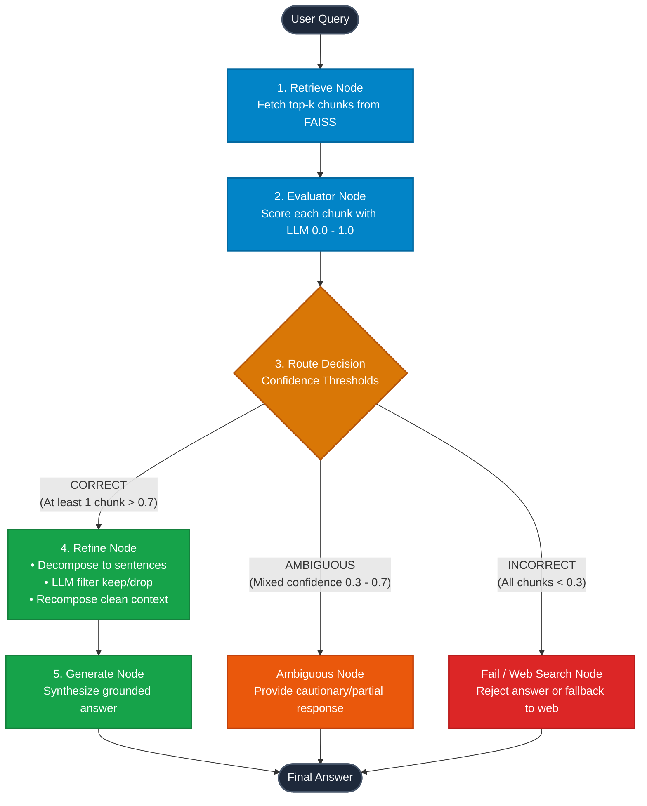

# Corrective RAG (CRAG) Tutorial

A comprehensive, production-oriented implementation of **Corrective Retrieval-Augmented Generation (CRAG)** built with **LangGraph**, **LangChain**, **FAISS Vector Database**, **Google Generative AI Embeddings**, and **Groq LLMs**.

---

## 📑 Table of Contents
- [Architecture & Workflow](#-architecture--workflow)
- [Step-by-Step Pipeline Walkthrough](#-step-by-step-pipeline-walkthrough)
  - [Part 1: Naive RAG (`1_basic_rag.ipynb`)](#part-1-naive-rag-1_basic_ragipynb)
  - [Part 2: Retrieval Refinement (`2_retrieval_refinement.ipynb`)](#part-2-retrieval-refinement-2_retrieval_refinementipynb)
  - [Part 3: Corrective Evaluator (`3_retrieval_evaluator.ipynb`)](#part-3-corrective-evaluator-3_retrieval_evaluatoripynb)
- [State Management](#-state-management)
- [Quick Start Guide](#-quick-start-guide)
- [Tech Stack](#-tech-stack)

---

## 🏗️ Architecture & Workflow

### Full Corrective RAG Flow (`3_retrieval_evaluator.ipynb`)



---

## 🔬 Step-by-Step Pipeline Walkthrough

### Part 1: Naive RAG (`1_basic_rag.ipynb`)
**The Baseline**: Standard retrieval-generation loop without validation or filtering.
1. **Ingest & Embed**: Loads PDF documents and indexes 900-character chunks with Google Gemini embeddings (`gemini-embedding-2-preview`) in FAISS.
2. **Retrieve**: Takes user query $\rightarrow$ retrieves top-$k$ most similar chunks.
3. **Generate**: Passes all raw retrieved chunks directly to Groq LLM.
> *Limitation*: Raw chunks often include irrelevant sentences, headers, or noise that can lead to hallucinations.

---

### Part 2: Retrieval Refinement (`2_retrieval_refinement.ipynb`)
**Knowledge Refinement (Decomposition $\rightarrow$ Filter $\rightarrow$ Recomposition)**

Instead of passing full raw chunks to the generator, this notebook cleans retrieved knowledge at the **sentence level**:


1. **Sentence Decomposition**:
   - Uses regex sentence boundaries `(?<=[.!?])\s+` to segment raw paragraphs into distinct sentences (`strips`).
   - Filters out short fragments (< 20 characters).
2. **Relevance Filtering (LLM Judge)**:
   - Evaluates each sentence against the user query using structured output:
     ```python
     class KeepOrDrop(BaseModel):
         keep: bool
     ```
   - Only sentences directly contributing to answering the question are kept (`kept_strips`).
3. **Context Recomposition**:
   - Glues retained sentences together into `refined_context`, eliminating up to 70% of retrieved noise.
4. **Grounded Generation**:
   - LLM answers strictly from the `refined_context`.

---

### Part 3: Corrective Evaluator (`3_retrieval_evaluator.ipynb`)
**The Full CRAG Pattern**: Adds confidence scoring and dynamic corrective routing.

```
                    ┌─────────────────┐
                    │ Evaluator Score │
                    │   (0.0 - 1.0)   │
                    └────────┬────────┘
                             │
            ┌────────────────┼────────────────┐
            ▼                ▼                ▼
     Score > 0.7       0.3 <= Score <= 0.7    Score < 0.3
      [CORRECT]          [AMBIGUOUS]         [INCORRECT]
            │                │                │
            ▼                ▼                ▼
    Sentence Refine    Partial Warning    Fallback / Fail
```

1. **Chunk Evaluation (`eval_each_doc_node`)**:
   - Each chunk receives a confidence score ($0.0 - 1.0$) and rationale using structured schema `DocEvalScore`:
     ```python
     class DocEvalScore(BaseModel):
         score: float
         reason: str
     ```
2. **Verdict Classification**:
   - **`CORRECT`**: At least one chunk scores $> 0.7$ (`UPPER_TH`). Chunks with score $> 0.3$ are passed to `good_docs`.
   - **`INCORRECT`**: All chunks score $< 0.3$ (`LOWER_TH`).
   - **`AMBIGUOUS`**: Intermediate scores with mixed signals.
3. **Dynamic Routing (`route_after_eval`)**:
   - Directs execution to `refine`, `ambiguous`, or `fail` (or external web search).

---

## 📊 State Management

The entire execution state is tracked across LangGraph nodes using a typed dictionary:

```python
class State(TypedDict):
    question: str                # User query
    docs: List[Document]         # Raw retrieved chunks from FAISS
    good_docs: List[Document]    # Chunks passing lower threshold (> 0.3)
    verdict: str                 # "CORRECT", "INCORRECT", or "AMBIGUOUS"
    reason: str                  # Evaluator explanation
    strips: List[str]            # Decomposed sentences
    kept_strips: List[str]       # Filtered relevant sentences
    refined_context: str         # Noise-free recomposed context
    answer: str                  # Final synthesized response
```

---

## 🚀 Quick Start Guide

### 1. Clone & Install
```bash
git clone https://github.com/vijayypandit/corrective-rag-tutorial.git
cd corrective-rag-tutorial

# Create and activate virtual environment
python -m venv .venv
.venv\Scripts\activate   # Windows
# source .venv/bin/activate # macOS/Linux

pip install -r requirements.txt
```

### 2. Configure Environment Variables
Create a `.env` file in the root directory:
```env
GROQ_API_KEY=your_groq_api_key_here
GOOGLE_API_KEY=your_google_gemini_api_key_here
```

### 3. Run Notebooks
```bash
jupyter notebook
```
Follow the progression in order:
1. `1_basic_rag.ipynb`
2. `2_retrieval_refinement.ipynb`
3. `3_retrieval_evaluator.ipynb`

---

## 🛠️ Tech Stack

| Component | Technology |
| :--- | :--- |
| **Workflow Engine** | [LangGraph](https://github.com/langchain-ai/langgraph) |
| **Framework** | [LangChain](https://github.com/langchain-ai/langchain) |
| **Vector Store** | [FAISS](https://github.com/facebookresearch/faiss) |
| **Embeddings** | Google Generative AI (`gemini-embedding-2-preview`) |
| **LLM Inference** | [Groq](https://groq.com/) (`openai/gpt-oss-120b` / `llama-3.3-70b-versatile`) |
| **Document Loaders** | `PyPDFLoader` / `PyMuPDFLoader` |
