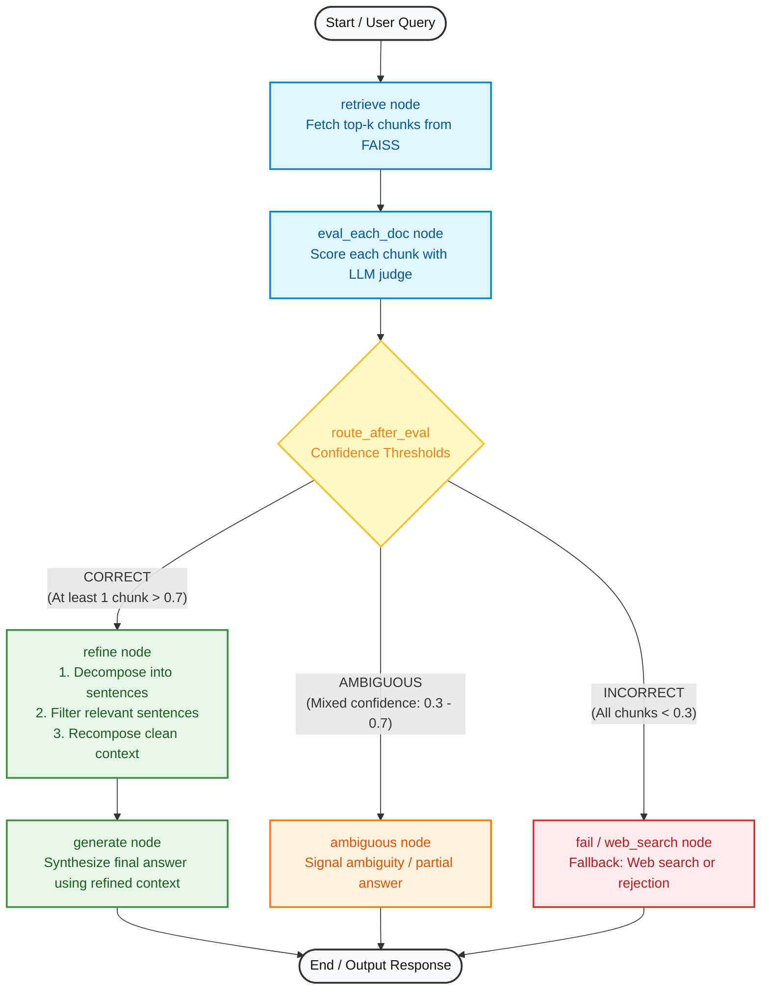

# Corrective RAG (CRAG) Tutorial

A comprehensive, step-by-step implementation of **Corrective Retrieval-Augmented Generation (CRAG)** using **LangGraph**, **LangChain**, **FAISS Vector Store**, **Google Generative AI Embeddings**, and **Groq LLMs**.

---

## 📖 Overview & Progression

This repository illustrates the step-by-step evolution of a RAG pipeline from a basic naive architecture to an advanced, production-grade Corrective RAG system:

| Notebook | Topic | Key Concepts |
| :--- | :--- | :--- |
| [`1_basic_rag.ipynb`](./1_basic_rag.ipynb) | **Naive RAG** | Baseline pipeline: Document loading, chunking, vector indexing, similarity search, and direct generation. |
| [`2_retrieval_refinement.ipynb`](./2_retrieval_refinement.ipynb) | **Retrieval Refinement** | Sentence-level decomposition, relevance filtering using an LLM judge (`KeepOrDrop`), and context recomposition to strip noise. |
| [`3_retrieval_evaluator.ipynb`](./3_retrieval_evaluator.ipynb) | **Corrective RAG (CRAG)** | Document confidence evaluator scoring, verdict classification (`CORRECT`, `AMBIGUOUS`, `INCORRECT`), conditional routing, refinement of high-confidence docs, and fallback handling. |

---

## 🏗️ Architecture & Workflow (Notebook 3)

The graph below represents the execution flow and decision logic implemented in [`3_retrieval_evaluator.ipynb`](./3_retrieval_evaluator.ipynb):



---

## 🔍 Detailed Node & Edge Breakdown

### 1. State Definition
The LangGraph `State` tracks document lifecycles and evaluation scores across nodes:
```python
class State(TypedDict):
    question: str
    docs: List[Document]
    good_docs: List[Document]
    verdict: str                  # "CORRECT", "INCORRECT", or "AMBIGUOUS"
    reason: str                   # Evaluator rationale
    strips: List[str]             # Decomposed sentences
    kept_strips: List[str]        # Filtered relevant sentences
    refined_context: str          # Noise-free recomposed context
    answer: str                   # Final synthesized output
```

### 2. Node Explanations

1. **`retrieve`**:
   - Queries the FAISS vector database using `gemini-embedding-2-preview` embeddings and returns the top-$k$ most relevant document chunks.

2. **`eval_each_doc` (Retrieval Evaluator)**:
   - Uses Groq LLM with structured output (`DocEvalScore: { score: float, reason: str }`) to grade each retrieved chunk between `0.0` and `1.0`.
   - **Evaluation Thresholds**:
     - $\text{Score} > 0.7$ (`UPPER_TH`): High relevance.
     - $\text{Score} < 0.3$ (`LOWER_TH`): Irrelevant.
   - **Verdict Logic**:
     - **`CORRECT`**: At least one chunk has $\text{score} > 0.7$. High-confidence chunks are added to `good_docs`.
     - **`INCORRECT`**: All chunks have $\text{score} < 0.3$.
     - **`AMBIGUOUS`**: No chunk exceeds $0.7$, but not all are below $0.3$.

3. **`route_after_eval` (Conditional Edge)**:
   - Dynamically routes execution based on `state["verdict"]`:
     - `CORRECT` $\rightarrow$ `refine`
     - `AMBIGUOUS` $\rightarrow$ `ambiguous`
     - `INCORRECT` $\rightarrow$ `fail` (or external web search).

4. **`refine` (Knowledge Refinement)**:
   - **Sentence-level Decomposition**: Splits paragraphs into individual sentences (`strips`).
   - **LLM Judge Filtering**: Evaluates each sentence against the query (`KeepOrDrop: { keep: bool }`), discarding irrelevant sentences/noise.
   - **Recomposition**: Merges retained sentences into `refined_context`.

5. **`generate`**:
   - Produces the final grounded response using strictly the clean `refined_context`.

---

## 🚀 Getting Started

### 1. Prerequisites & Environment Setup

Clone the repository:
```bash
git clone https://github.com/vijayypandit/corrective-rag-tutorial.git
cd corrective-rag-tutorial
```

Create a virtual environment and install dependencies:
```bash
python -m venv .venv
# On Windows
.venv\Scripts\activate
# On macOS/Linux
source .venv/bin/activate

pip install -r requirements.txt
```

### 2. Configure Environment Variables

Create a `.env` file in the root directory:
```env
GROQ_API_KEY=your_groq_api_key_here
GOOGLE_API_KEY=your_google_gemini_api_key_here
```

### 3. Run the Notebooks

Launch Jupyter Notebook:
```bash
jupyter notebook
```
Open and run the notebooks in sequence:
1. `1_basic_rag.ipynb`
2. `2_retrieval_refinement.ipynb`
3. `3_retrieval_evaluator.ipynb`

---

## 🛠️ Tech Stack

- **Orchestration**: [LangGraph](https://github.com/langchain-ai/langgraph) & [LangChain](https://github.com/langchain-ai/langchain)
- **Vector Database**: [FAISS](https://github.com/facebookresearch/faiss)
- **Embeddings**: Google Generative AI (`gemini-embedding-2-preview`)
- **LLM Inference**: [Groq](https://groq.com/)
- **Document Loading**: PyPDF / PyMuPDF
